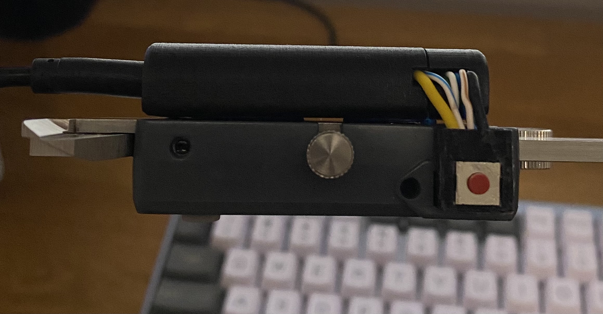

# Bluetooth-Calipers

### Sends caliper data to connected bluetooth device when button is pressed.

---

The goal of this project was to recreate the functinoality of [Mitutoyo's bluetooth U-WAVE](https://www2.mitutoyo.co.jp/eng/products/keisokusystem/wireless.html) using innexpensive hardware (total cost, excluding calipers, ~$15).

I ended up using USB for power since I am always near my computer when using this and did not want to manage a battery. There is no reason a 3.3v battery could not be added to make it fully wireless. Bluetooth was chosen to send data since many ESP32's are not able to act as a HID (i.e. cannot act as keyboard/mouse). 

Supports two types of button presses: 
1. **Short press**: Data is sent without pressing the return key (used when you want to modify the value)
2. **Long press**: Data is sent and the enter key is pressed (used when the value does not need to be modified)

---

Includes custom 3D files (STEP, 3mf, and STL) that provide a right angle connector for the connector and button as well as a case for the ESP32. 

I have only tested with iGaging calipers that have a 5-pin data port. This should also work with Mitutoyo devices or other iGaging devies with a 5-pin data port.  

---

## Required Hardware
1. ESP32 - I used [this development board from amazon](https://www.amazon.com/HiLetgo-ESP-WROOM-32-Development-Microcontroller-Integrated/dp/B0718T232Z/ref=sr_1_4?crid=5GS42RL0ZTBY&keywords=esp32&qid=1653872753&sprefix=esp32%2Caps%2C75&sr=8-4)
2. Button - I used a 6mm x 6mm x 3.1mm button [from this kit on amazon](https://www.amazon.com/gp/product/B07LCBLB8N/ref=ppx_yo_dt_b_asin_title_o08_s00?ie=UTF8&psc=1)
3. 1 2N2222 Transistor 
4. 1 100k ohm resistor
5. Solid core wire (I tested with internal wires from solid core ethernet cables and breadboard jumper cables)
6. Wire/solder
7. 3D printer

---

## Build Guide

### Prepare the connector 

 1. Print "Caliper Data Port Connector - 5 pin". I found TPU worked the best. 
 2. Feel solid core wire as shows in the image below. Once all 5 wire are fed through, I used some super glue to hold them in place but it is not needed. 

 3. Solder wires to the button and insert it in the squre hole on the top of the connector piece, first feeding through the wires. 

### Making Connections
NOTE: PINS ARE EASY TO GET MIXED UP. 

Pins, as originally doccumented, from RIGHT to LEFT on calipers:
  1. GND - Ground 
  2. DATA - Measured data
  3. CK - Clock
  4. NA - No Connection
  5. REQ - Request
 

Since they were originally doccumented goings from RIGHT to LEFT when looking AT them on the calipers, their orientation flips for the image below (i.e. pin 1 on the LEFT and pin 5 on the RIGHT)

#### Soldering Steps
  0. De-solder any pins on the board. 
  1. Solder one button wire to pin 5 on the ESP32 and the other button wire to a ground pin on the ESP32.
  2. Solder GND (pin 1) from the connector to a ground pin on the ESP32.
  3. Solder the 100k ohm resister to the middle pin of the 2N2222 transistor.
  4. Solder the other end of the resistor to pin 2 on the ESP32.
  5. Solder the emitter pin on the 2N2222 transistor (right pin when flat side is facing you) to a ground pin on the ESP32.
  6. Solder collector pin on the 2N2222 transistor (left pin when flat side is facing you) to pin 5 on the connector.
  7. Solder DATA (pin 2) fron the connector to pin 4 on the ESP32.
  8. Solder CLK (pin 3) from the connector to pin 0 on the ESP32.
  9. Solder the REQ (pin 5) from the connect to pin 2 on the ESP32

### Finishing up
1. Flash code using platformIO or Arduino IDE
2. Move everthing into the case and connect connector to data port
3. Attach case to back of calipers (blutak, velcro, glue, VHB Tape, etc. all seem to work well)
4. When plugged in for the first time, connect to bluetooth device named "ESP32 Keyboard"

Once connected, used either the short or long press to send data to your connected device. 

---
## External Sources
Number 1 was used heavily for diagrams and base code (useful when you want to constantly return a value via USB without a button press). 
Number 2 has additional schematics and links to doccumentions provided by mitutoyo 

1. https://www.instructables.com/Interfacing-a-Digital-Micrometer-to-a-Microcontrol/
2. https://github.com/Roger-random/mitutoyo
